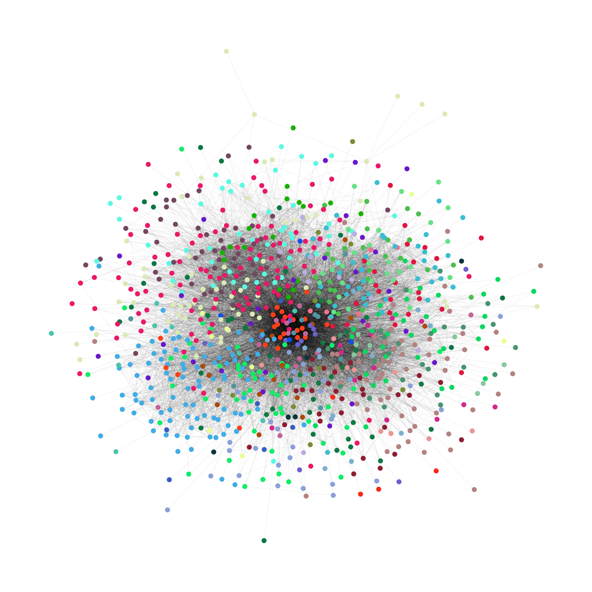

# Predicting a community in a social network

## Short description

Node prediction based on *email-Eu-core* dataset visualised below. The network consist of 986 nodes grouped into 37 groups.
Experiments:
- Graph Attention Network (GAT)
- Graph Convolutional Network (GCN) 

In addition a `node2vec` method is used to generate an extra information about each node.

